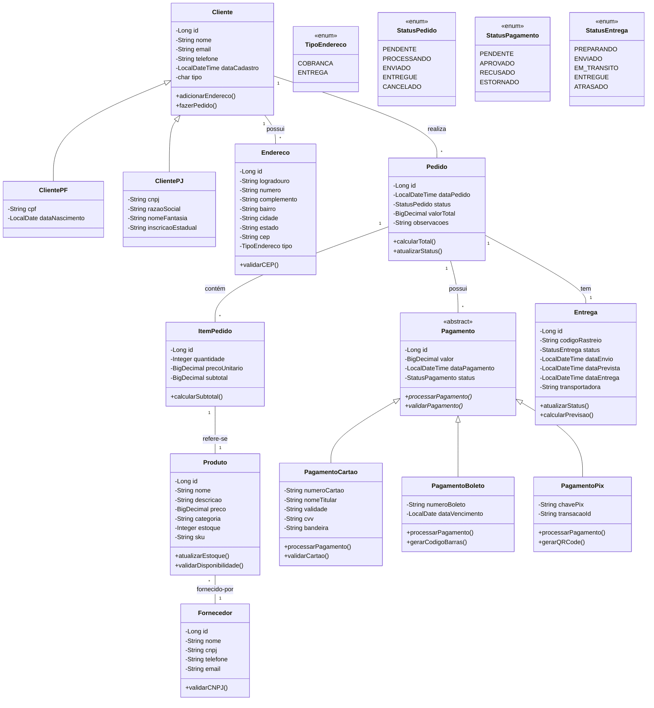

# Diagrama de Classes - Modelo Entidade-Relacionamento

## Descrição das Classes e Relacionamentos

### Herança e Especialização
- **Cliente** → Classe base abstrata
- **ClientePF** e **ClientePJ** → Herdam de Cliente
- **Pagamento** → Classe abstrata para formas de pagamento
- **PagamentoCartao**, **PagamentoBoleto**, **PagamentoPix** → Herdam de Pagamento

### Relacionamentos de Composição
- **Cliente 1:N Endereco** → Um cliente possui múltiplos endereços
- **Cliente 1:N Pedido** → Um cliente realiza múltiplos pedidos
- **Pedido 1:N ItemPedido** → Um pedido contém múltiplos itens
- **Pedido 1:N Pagamento** → Um pedido pode ter múltiplos pagamentos

### Relacionamentos de Associação
- **ItemPedido N:1 Produto** → Itens referenciam produtos
- **Produto N:1 Fornecedor** → Produtos são fornecidos por fornecedores
- **Pedido 1:1 Entrega** → Cada pedido tem uma entrega

### Atributos Chave
- Todas as classes possuem **ID** como identificador único
- **Valores monetários** usam BigDecimal para precisão
- **Datas** usam LocalDateTime/LocalDate
- **Enums** para status e tipos fixos